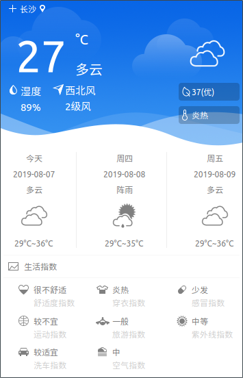

# indicator-china-weather (麒麟天气/优客天气)

支持Ubuntu 18.04/22.04的天气小程序。

### 关于本Repo
+ 修复天气API接口（内置appKey，但是每日限制访问16700次；当访问量超标，需更换为自己的appKey）
+ 通过修改weatherworker.cpp的appKey变量使用自己从和风开发申请的appKey[https://dev.qweather.com/](https://dev.qweather.com/).
+ Ubuntu18.04+修复系统托盘的方法(参考：https://help.jianguoyun.com/?p=4793):
 - 下载gnome 3.28对应的topIcons-plus
 - 解压到目录，并make install
 - 运行gnome-tweaks，在扩展栏，开启TopIcons plus。

### 作者主页

+ [Eight Plus &rarr;](https://eightplus.github.io/)
+ [Tom Heaven](http://tomheaven.cn)

### 国际化

1. lupdate indicator-china-weather.pro
2. linguist translation/indicator-china-weather_zh_CN.ts
3. lrelease indicator-china-weather.pro

### Lintian

lintian -i -EvIL +pedantic --verbose ../indicator-china-weather_3.0.0_amd64.changes
